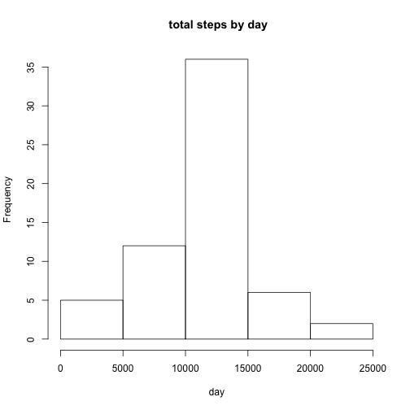

Assessment 1
=========================

Loading and preprocessing the data
Show any code that is needed to
Load the data (i.e. read.csv())
Process/transform the data (if necessary) into a format suitable for your analysis

```r
library(knitr)
library(dplyr)
library(ggplot2)
library(plyr)
library(doBy)
library(knitr)

knit2html("PA1_template.rmd")
```

```
## 
## 
## processing file: PA1_template.rmd
```

```
## 
  |                                                                       
  |                                                                 |   0%
  |                                                                       
  |......                                                           |   9%
##   ordinary text without R code
## 
## 
  |                                                                       
  |............                                                     |  18%
## label: unnamed-chunk-6
```

```
## 
  |                                                                       
  |..................                                               |  27%
##   ordinary text without R code
## 
## 
  |                                                                       
  |........................                                         |  36%
## label: unnamed-chunk-7
```

```
## 
  |                                                                       
  |..............................                                   |  45%
##   ordinary text without R code
## 
## 
  |                                                                       
  |...................................                              |  55%
## label: unnamed-chunk-8
```

```
## 
  |                                                                       
  |.........................................                        |  64%
##   ordinary text without R code
## 
## 
  |                                                                       
  |...............................................                  |  73%
## label: unnamed-chunk-9
```

```
## 
  |                                                                       
  |.....................................................            |  82%
##   ordinary text without R code
## 
## 
  |                                                                       
  |...........................................................      |  91%
## label: unnamed-chunk-10
## 
  |                                                                       
  |.................................................................| 100%
##   ordinary text without R code
```

```
## output file: PA1_template.md
```

```r
# 1.Load the data and 2.Process/transform the data (if necessary) into a format suitable for your analysis

# what is the working directory
wd <- getwd()
```

 

```r
wd
```

```
## [1] "/Volumes/sdata/p/Coursera/5_Reproducible_Research"
```

```r
# read the input file ativity.csv in df - the column steps shall have the format integer
df <- read.csv("activity.csv", header = TRUE, na.strings="NA", colClasses =c("integer", "Date", "integer"), sep=",")

# What is the data structure of df
str(df)
```

```
## 'data.frame':	17568 obs. of  3 variables:
##  $ steps   : int  NA NA NA NA NA NA NA NA NA NA ...
##  $ date    : Date, format: "2012-10-01" "2012-10-01" ...
##  $ interval: int  0 5 10 15 20 25 30 35 40 45 ...
```

```r
# first analysis of df
summary(df)
```

```
##      steps             date               interval     
##  Min.   :  0.00   Min.   :2012-10-01   Min.   :   0.0  
##  1st Qu.:  0.00   1st Qu.:2012-10-16   1st Qu.: 588.8  
##  Median :  0.00   Median :2012-10-31   Median :1177.5  
##  Mean   : 37.38   Mean   :2012-10-31   Mean   :1177.5  
##  3rd Qu.: 12.00   3rd Qu.:2012-11-15   3rd Qu.:1766.2  
##  Max.   :806.00   Max.   :2012-11-30   Max.   :2355.0  
##  NA's   :2304
```

```r
# pairs(df)
tail(df)
```

```
##       steps       date interval
## 17563    NA 2012-11-30     2330
## 17564    NA 2012-11-30     2335
## 17565    NA 2012-11-30     2340
## 17566    NA 2012-11-30     2345
## 17567    NA 2012-11-30     2350
## 17568    NA 2012-11-30     2355
```

```r
dim(df)
```

```
## [1] 17568     3
```

### What is mean total number of steps taken per day?
For this part of the assignment, you can ignore the missing values in the dataset.
Calculate the total number of steps taken per day
If you do not understand the difference between a histogram and a barplot, research the difference between them. Make a histogram of the total number of steps taken each day
Calculate and report the mean and median of the total number of steps taken per day


```r
# Calculate the total number of steps taken per day
total_steps <- aggregate(steps ~ date, data = df, sum, na.rm = TRUE)

# draw the histogram
hist(total_steps$steps, main = " total steps by day", xlab ="day")
```

 

```r
# Calculate and report the mean and median of the total number of steps taken per day
steps_mean <- mean(total_steps$steps)
steps_median <- median(total_steps$steps)
```


        The mean of the total number of steps taken each day is 10.766,188.
        The median of the total number of steps taken each day is 10.765


### What is the average daily activity pattern?
Make a time series plot (i.e. type = "l") of the 5-minute interval (x-axis) and the average number of steps taken, averaged across all days (y-axis)
Which 5-minute interval, on average across all the days in the dataset, contains the maximum number of steps?


```r
# make a time series plot
df_neu <- df
df_neu1 <- tapply(df_neu$steps, df_neu$interval, mean, na.rm = TRUE)

plot(row.names(df_neu1), df_neu1, type = "l", xlab = "5-min interval", 
    ylab = "averaged across all days", main = "average number of steps taken", 
    col = "blue")
```

 

```r
# Which 5-minute interval, on average across all the days in the dataset, contains the maximum number of steps?
max_interval <- which.max(df_neu1)
names(max_interval)
```

```
## [1] "835"
```
The 835 interval, on average across all the days in the dataset, contains the maximum number of steps.


### Imputing missing values

Note that there are a number of days/intervals where there are missing values (coded as NA). The presence of missing days may introduce bias into some calculations or summaries of the data.

Calculate and report the total number of missing values in the dataset (i.e. the total number of rows with NAs)

Devise a strategy for filling in all of the missing values in the dataset. The strategy does not need to be sophisticated. For example, you could use the mean/median for that day, or the mean for that 5-minute interval, etc.

Create a new dataset that is equal to the original dataset but with the missing data filled in.

Make a histogram of the total number of steps taken each day and Calculate and report the mean and median total number of steps taken per day. Do these values differ from the estimates from the first part of the assignment? What is the impact of imputing missing data on the estimates of the total daily number of steps?

```r
#Calculate and report the total number of missing values in the dataset (i.e. the total number of rows with NAs)
number_complete_df <- sum(complete.cases(df))
number_not_complete_df <- sum(!complete.cases(df))

#Devise a strategy for filling in all of the missing values in the dataset. The strategy does not need to be sophisticated. For example, you could use the mean/median for that day, or the mean for that 5-minute interval, etc.
#Create a new dataset that is equal to the original dataset but with the missing data filled in.

# take the mean for each 5-minute interval and create a new dataset that is equal to the original dataset but with the missing data filled in
df_tmp <- df
impute.mean <- function(x) replace(x, is.na(x), mean(x, na.rm = TRUE))
df_n <- ddply(df_tmp, ~ interval, transform, steps = impute.mean(steps))

# Calculate the total number of steps taken per day
total_steps_n <- aggregate(steps ~ date, data = df_n, sum)

# draw the histogram
hist(total_steps_n$steps, main = " total steps by day", xlab ="day")
```

 

```r
# Calculate and report the mean and median of the total number of steps taken per day
steps_mean_n <- mean(total_steps_n$steps)
steps_median_n <- median(total_steps_n$steps)
```

        The total number of rows with NAs is 2304
        The mean of the total number of steps taken each day is 10.766,188
        The median of the total number of steps taken each day is 10.766,188
        Do these values differ from the estimates from the first part of the assignment? 
        Yes, they show a difference in the median. Fillin missing data changes the median.

       


Are there differences in activity patterns between weekdays and weekends?

### THIS exercise is missing - sorry!


